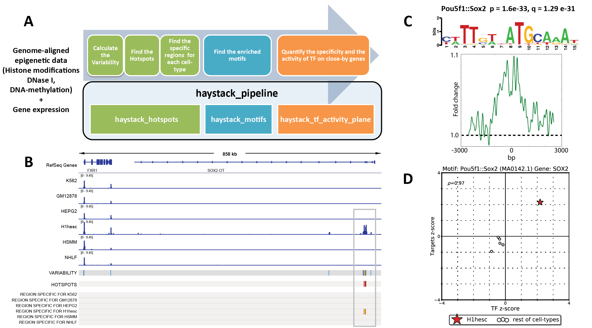
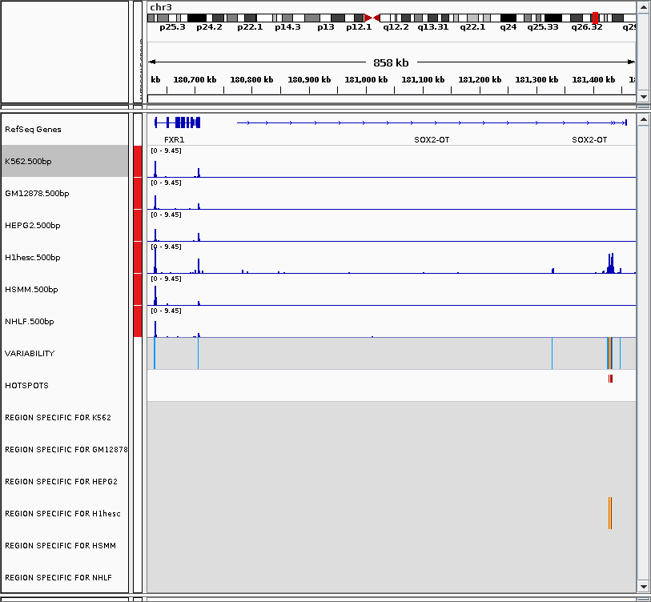
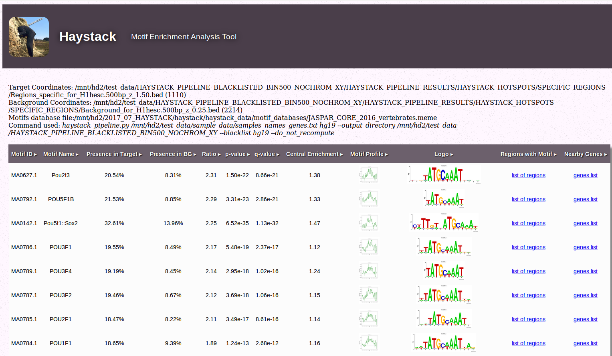
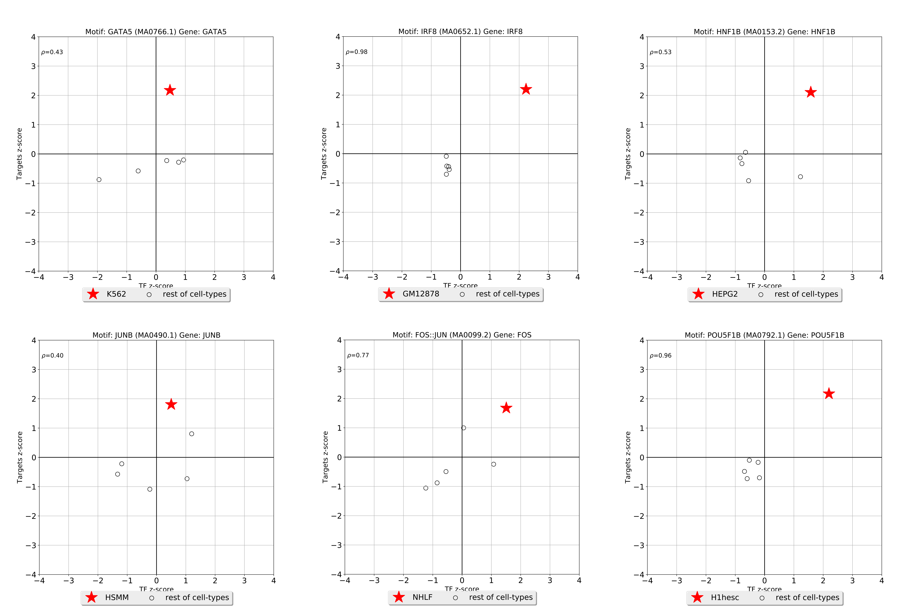
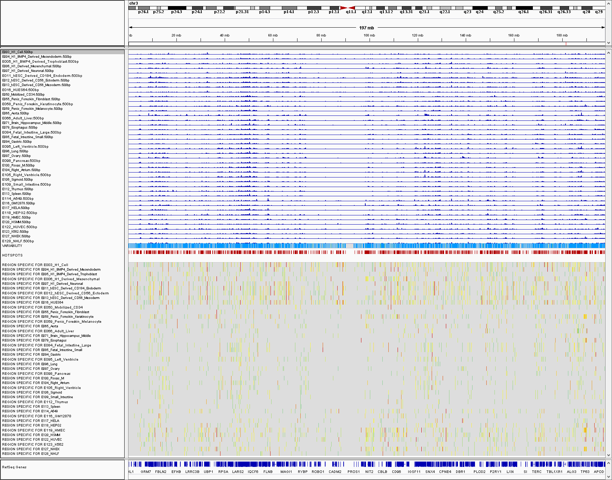
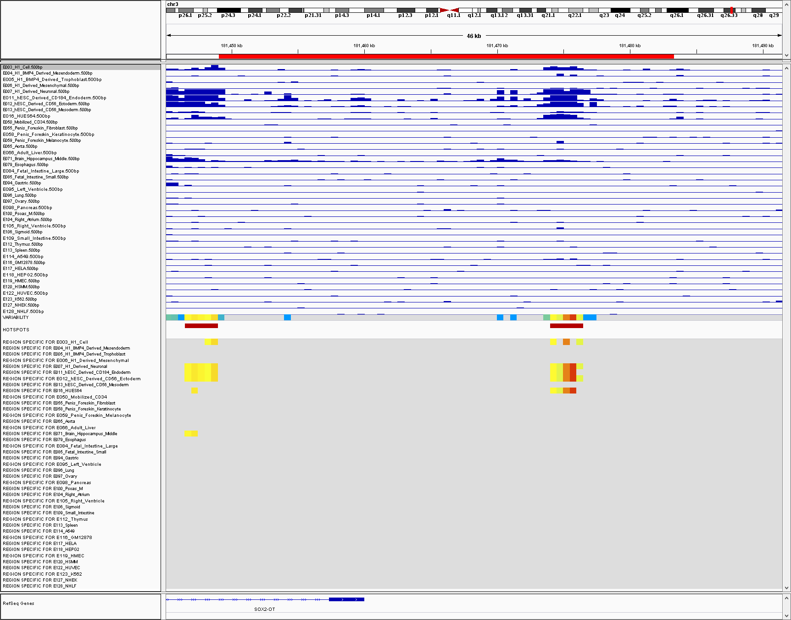
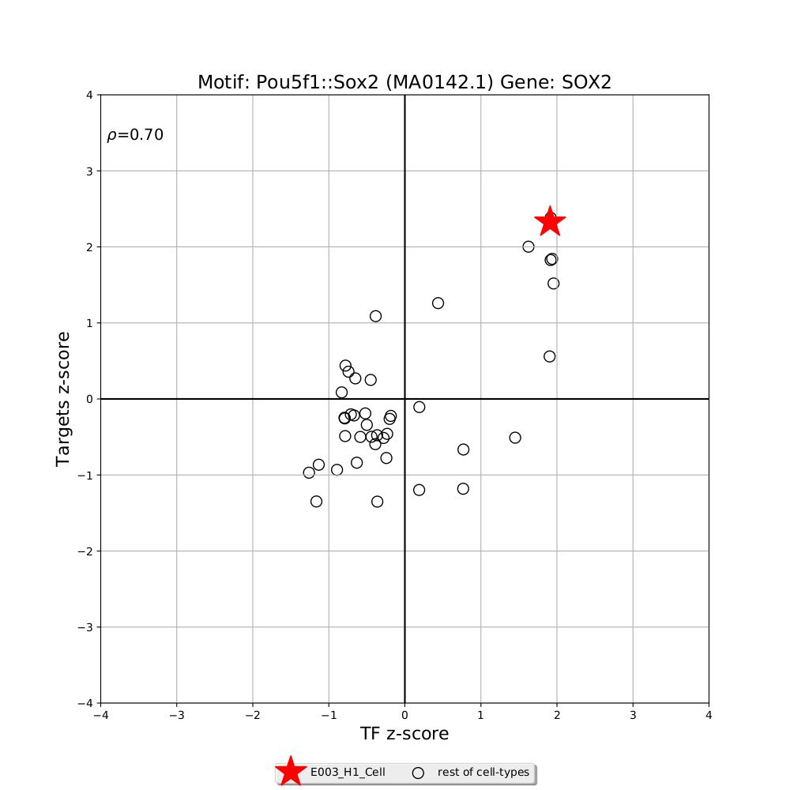
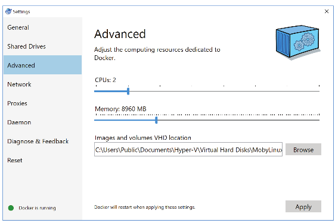

*haystack_bio* 
========
Epigenetic Variability and Motif Analysis Pipeline       
--------------------------------------------------
**Current version**: 0.5.2

[](https://travis-ci.org/pinellolab/haystack_bio)


[](http://bioconda.github.io/recipes/haystack_bio/README.html)


Summary
-------

*haystack_bio* 
========
Epigenetic Variability and Motif Analysis Pipeline       
--------------------------------------------------
**Current version**: 0.5.2

[](https://travis-ci.org/pinellolab/haystack_bio)


[](http://bioconda.github.io/recipes/haystack_bio/README.html)


Summary
-------

Haystack is a suite of computational tools implemented in a Python 2.7 package called ***haystack_bio*** to study epigenetic variability, cross-cell-type plasticity of chromatin states and transcription factors (TFs) motifs providing mechanistic insights into chromatin structure, cellular identity and gene regulation.

Through the integration of epigenomic, DNA sequence, and gene expression data, haystack_bio identifies highly variable regions across different cell types (called _hotspots_) and the potential regulators that mediate the cell-type specific variation. 

***haystack_bio*** can be used with histone modifications and chromatin accessibility data generated by ChIP-seq, DNase-Seq, and ATAC-seq assays across multiple cell-types. In addition, it is also possible to integrate gene expression data generated by RNA-seq for example. In particular, ***haystack_bio*** highlights enriched TF motifs in variable and cell-type specific regions and quantifies their activity and specificity on nearby genes if gene expression data are available.

A summary of the pipeline and an example on H3k27ac data is shown in Figure 1 below.

<p align="center">
<figure>
  
</figure> 
</p>

**(A)** haystack_bio overview: modules and corresponding functions.

**(B)** Hotspot analysis on H3k27ac: signal tracks, variability track and the hotspots of variability are computed from the ChIP-seq aligned data; in addition, the regions specific for a given cell type are extracted. 

**(C)** Motif analysis on the regions specific for the H1hesc cell line: Pou5f1::Sox2 is significant; p-value and q-value, motif logo and average profile are calculated. 

**(D)** Transcription factor activity for Sox2 in H1esc (star) compared to the other cell types (circles), x-axis specificity of Sox2 expression (z-score), y-axis effect (z-score) on the gene nearby the regions containing the Sox2 motif. 


Installation
----------------

The Haystack pipeline is implemented as a Python package called *haystack_bio*. The software has been tested on several operating systems: CentOS 6.5, Ubuntu 14.04 LTS, Ubuntu 16.04 LTS, OS X 10.11, and OS X 10.12.
Although haystack_bio supports only 64-bit Linux and macOS, it can be run on Windows systems or other operating systems using the provided Docker image.
For instructions on how to install the Docker software and the docker image, please refer to the *Other Installation Options* section below.

**Bioconda installation for Linux and macOS**

***haystack_bio*** and all its dependencies can be easily installed automatically through Bioconda (https://bioconda.github.io/), a software repository channel for the conda package manager. Bioconda streamlines the process of building and installing any software dependency that a package requires.
The entire installation process consists of three steps: installing Miniconda, adding the Bioconda channel, and installing haystack_bio. For the following steps, we are assuming you are on a 64-bit Linux or a macOS system and that you have not installed Miniconda/Anaconda before on your system.
If you have conda already installed please skip to Step 3. To use haystack_bio on a Windows system please refer to the Docker section.

**Step 1**: Download the latest Miniconda 2 (Python 2.7) to your home directory.

For Linux
    
    wget -c https://repo.continuum.io/miniconda/Miniconda2-latest-Linux-x86_64.sh -O $HOME/miniconda.sh

For Mac:

    wget -c https://repo.continuum.io/miniconda/Miniconda2-latest-MacOSX-x86_64.sh -O $HOME/miniconda.sh

 
**Step 2**: Give permissions to execute the file as a program and execute the program
 
    bash $HOME/miniconda.sh

**Step 3**: Update the conda repository and add the repository channels in the following order of priority by running these four lines in the order shown.

     conda update --all --yes
     conda config --add channels defaults
     conda config --add channels conda-forge
     conda config --add channels bioconda

**Step 4**: Install ***haystack_bio*** and its dependencies by simply running:

    conda install haystack_bio
    

Notes on installation: In case you encounter difficulty in installing Miniconda or adding the Bioconda channel,
please refer to the Bioconda project's [website](https://bioconda.github.io/) for more detailed installation instructions. Note that if you have Minicoda/Anaconda 3 already installed, you would need to create a separate environment for Python 2.7. 
Please consult [conda.io](https://conda.io/docs/py2or3.html#create-python-2-or-3-environments) for details.


Testing Installation
-----------------

To test if the package was successfully installed, please run the following command.

     haystack_hotspots -h
  
The  *-h* help flag outputs a list of all the possible command line options that you can supply to the *haystack_hotspots* module. 
If you see such a list, then the software has been installed successfully.

We strongly suggest testing the entire pipeline on your system using the sample data for the hg19 reference genome bundled with the package by running the command

    haystack_run_test

The command will download the hg19 reference genome automatically if you had not downloaded it before. Since it is necessary to download about 800MB, this step could take a long time on a slow internet connection. We do not include any reference genome with the installation since those files tend to be rather big. If the test completes successfully, you should see the message “Test completed successfully” in the console.
The reference genome hg19 (or any other genome such as mm9, mm10, hg38) can be also downloaded before performing the test with the command

    haystack_download_genome hg19

The reference genomes and some required additional files are always saved into a dedicated genomes folder, by default in this path

    $HOME/miniconda/lib/python2.7/site-packages/haystack/haystack_data/genomes

Note: The path could be slightly different depending on the Anaconda/Miniconda version installed (e.g. $HOME/miniconda2 ). Also note that since the sample test data included in the package is for 4 cell types only and is limited to a small fraction of the genome (i.e. Chromosome 21), the motif analysis step in the pipeline might not return any positive findings.
The test run output can be found in the folder $HOME/haystack_test_output.

How to use *haystack_bio*
-------------------

***haystack_bio*** consists of the following three modules.

1) **haystack_hotspots**: finds regions that are variable across different ChIP-seq, DNase-seq, ATAC-seq or similar assays.
2) **haystack_motifs**: finds enriched transcription factor motifs in a given set of genomic regions.
3) **haystack_tf_activity_plane**: quantifies the specificity and the activity of the TFs highlighed by the **haystack_motif** integrating gene expression data.

The command **haystack_pipeline**  executes the whole pipeline automatically. That is, it executes Module 1 followed by Module 2 and (optionally) Module 3 (if gene expression files are provided), 
finding hotspots, specific regions, motifs and quantifying their activity on nearby genes.


## A walk-through example using ENCODE ChIP-seq data for the H3K27ac histone mark in six cell types
-------------------

In this section, we showcase the commands using the example we have in the paper. We recreate the output produced by the pipeline when running on the entire genome with six cell types.
 
Step 1: Open a command terminal in the directory of your choosing and download the complete set of data files as an archive file to that directory.
 
     wget -O data_h3k27ac_6cells.zip https://www.dropbox.com/s/4yjx7ypj0c82ryh/data_h3k27ac_6cells.zip?dl=1

Step 2: Decompress the archive file and change directory
	
	    unzip data_h3k27ac_6cells.zip?dl=1 -d $HOME
	    cd $HOME/data_h3k27ac_6cells
	
The command will unzip the data files archive into a folder called data_h3k27ac_6cells.
Inside the folder you will see a _samples_names.txt_ file containing the relative paths to the data files.	
The file is a tab delimited text file with three columns containing 

1. The sample name (cell type)
2. The path of the corresponding BAM file 
3. The path of the gene expression file. Note that this last column is optional.

```
K562	K562H3k27ac_sorted_rmdup.bam	K562_genes.txt
GM12878	Gm12878H3k27ac_sorted_rmdup.bam GM12878_genes.txt
HEPG2	Hepg2H3k27ac_sorted_rmdup.bam	HEPG2_genes.txt
H1hesc	H1hescH3k27ac_sorted_rmdup.bam	h1hesc_genes.txt
HSMM	HsmmH3k27ac_sorted_rmdup.bam	HSMM_genes.txt
NHLF	NhlfH3k27ac_sorted_rmdup.bam	NHLF_genes.txt
```

Step 3: Run the pipeline inside the data directory
	
	 haystack_pipeline samples_names.txt  hg19 --output_directory $HOME/HAYSTACK_H3K27Aac --blacklist hg19

The *haystack_pipeline* command saves the output to the folder "HAYSTACK_H3K27Aac" in your home directory. All the results will be stored in inside the sub-folder HAYSTACK_PIPELINE_RESULT.
This will recreate the panels and the plots showed in the figure present in the summary, plus other panels and plots for all the other cell-types contained in the test dataset. 

The *--blacklist* command accepts a file of blacklisted genomic regions in BED format. We suggest excluding those regions since they are characterized by artifact signals.
For hg19, we have provided a BED file of blacklisted regions inside the package and this can be automatically loaded specifying just the string ‘hg19’ as in our example. 
This file was obtained merging the ENCODE Data Analysis Consortium (DAC) Blacklisted Regions, the Duke Excluded Regions, and gap locations such as centromeres, telomeres, and contigs into one file.

The *haystack_pipeline* command is equivalent to running *haystack_hotspots* followed by *haystack_motifs* and *haystack_tf_activity_plane*.

You can run the pipeline also without creating a _samples_names.txt_ file by providing the folder containing the BAM or bigWig files with the commands: 

•	Folder with BAM files:

	haystack_hotspots $HOME/data_h3k27ac_6cells hg19 --output_directory $HOME/HAYSTACK_H3K27ac --blacklist hg19

•	Folder with bigwig files:

	haystack_hotspots $HOME/data_h3k27ac_6cells hg19 --output_directory $HOME/HAYSTACK_H3K27ac --blacklist hg19 --input_is_bigwig

Note, however, that in this case the pipeline runs haystack_hotspots and haystack_motifs, but not haystack_tf_activity_plane since no gene expression data are provided.	

The inputs and outputs of the three modules of the pipeline are as follows.

### Module 1: *haystack_hotspots*

This step finds hotspots, which we define as regions that are highly variable among different cell types for a given epigenetic mark.

**Sub-command run by _haystack_pipeline_**: 	

       haystack_hotspots samples_names.txt  hg19 --output_directory $HOME/HAYSTACK_H3K27Aac --blacklist hg19

**Input**: 
 - The first two columns of _samples_names.txt_  containing (1) the sample name and (2) the full path of the corresponding BAM or bigWig file. 
     
     ```
    K562	K562H3k27ac_sorted_rmdup.bam
    GM12878	Gm12878H3k27ac_sorted_rmdup.bam
    HEPG2	Hepg2H3k27ac_sorted_rmdup.bam
    H1hesc	H1hescH3k27ac_sorted_rmdup.bam
    HSMM	HsmmH3k27ac_sorted_rmdup.bam
    NHLF	NhlfH3k27ac_sorted_rmdup.bam
    ```
 - The reference genome (e.g.hg19)
 - An optional bed file with blacklisted regions (the one for hg19 has been provided)

**Output**: 
- The normalized bigWig files for each of the six samples.
- A file of specific regions for each of the six samples. These are regions in which the signal is more enriched for a particular sample compared to the rest.
- A file of background regions for each of the six samples. 
- A SELECTED_VARIABILITY_HOTSPOT.bedgraph file containing the hotspots (i.e. regions that are most variable)
- A session file (.xml) for the IGV software (http://www.broadinstitute.org/igv/) from the Broad Institute to easily visualize all the tracks produced, 
the hotspots and the specific regions for each cell line. To load it just drag and drop the file _OPEN_ME_WITH_IGV.xml_ from the output folder on top of the IGV window or alternatively load it in IGV with File-> Open Session... If you have trouble opening the file please update your IGV version. Additionally, please don't move the .xml file only, you need all the files in the output folder to correctly load the session.

Figure 2 is a screenshot of the IGV browser showing the bigWig tracks, the hotspots, and the specific regions.

<p align="center">
<figure>
  
</figure> 
</p>


#### Notes:

- IMPORTANT: Folder names and file paths should not have white spaces. Please use underscore instead.
- If you are running haystack_hotspots using bigWig files you need to add the option: --input_is_bigwig
- The haystack_download_genome command allows you to download and add a reference genome from UCSC to haystack_bio in the appropriate format.
   To download a particular genome run

	     haystack_download_genome genome_name

    You probably would not need to call this command explicitly since it is called automatically when you run the pipeline.

### Module 2: **haystack_motifs**

This step takes in a set of genomic region hotspots for each cell-type sample and identifies transcription factors whose binding sequence motifs are enriched in those regions.

**Sub-command run by _haystack_pipeline_** (for each sample): 	

           haystack_motifs specific_regions_filename  hg19 --bed_bg_filename  background_regions_filename --name sample_name --output_directory $HOME/HAYSTACK_H3K27Aac/HAYSTACK_PIPELINE_RESULT/HAYSTACK_MOTIFS

**Input**: 
- Specific region file (i.e. *Regions_specific_for_K562.500bp_z_1.50.bed*)
- The reference genome (i.e. hg19)
- Background regions file (i.e. *Background_for_K562.500bp_z_0.25.bed*)
- Sample name (i.e. K562)

**Output**: The output consists of an HTML report for each sample. For example, Figure 3 is a screenshot of the HTML report generated for the *H1hesc* sample. 

<p align="center">
<figure>
  
</figure> 
</p>
 
Each row in the table corresponds to an enriched motif. There are 12 columns in the table corresponding to following variables.

- Motif id
- Motif name
- Presence in Target: Frequency of its presence in the  specific region file of the corresponding sample
- Presence in BG: Frequency of its presence in the  background region file of the corresponding sample
- The ratio of Presence in Target to Presence in BG
- The p value (calculated with the Fisher’s exact test) 
- The q values
- Central enrichment
- Motif profile
- Motif logo
- List of regions with a particular motifs and coordinates of the motifs in those regions
- List of closest genes to the regions with a particular motif 

#### Notes:

- It is possible to run the motif analysis only by calling the haystack_motifs module on a given set of genomic regions.  For example, to analyze the BED file *myregions.bed* on the hg19 genome, run

        haystack_motifs myregions.bed hg19

- To specify a custom background file for the analysis, for example mybackgroundregions.bed run

        haystack_motifs myregions.bed hg19 --bed_bg_filename mybackgroundregions.bed

- To use a particular motif database (the default is JASPAR) use

        haystack_motifs myregions.bed hg19 --meme_motifs_filename my_database.meme

- Note that the database file must be in the [MEME format](http://meme.nbcr.net/meme/doc/meme-format.html#min_format)


### Module 3: **haystack_tf_activity_plane**

This step acts as an additional filter to restrict the set of enriched transcription factors found in the previous step to those that also exhibit statistically 
significant correlations with the expression of genes found in hotspot regions.

**Sub-command run by _haystack_pipeline_** (for each sample): 	

        haystack_tf_activity_plane $HOME/HAYSTACK_H3K27Aac/HAYSTACK_PIPELINE_RESULT/HAYSTACK_MOTIFS  sample_names_tf_activity_filename sample_name --output_directory $HOME/HAYSTACK_H3K27Aac/HAYSTACK_PIPELINE_RESULT/HAYSTACK_TFs_ACTIVITY_PLANES

**Input**: 
- An output folder generated by **haystack_motif** 
- A tab delimited file describing the samples names and the gene expression filenames to use (for example the first and third column of samples_names.txt used by the pipeline): 
```
K562	K562_genes.txt
GM12878	GM12878_genes.txt
HEPG2	HEPG2_genes.txt
H1hesc	h1hesc_genes.txt
HSMM	HSMM_genes.txt
NHLF	NHLF_genes.txt
```
- A set of files containing gene expression data specified in a tab delimited format with two columns: (1) gene symbol and (2) gene expression value, for example the file K562_genes.txt may contain the lines:

```
RNF14	7.408579
UBE2Q1	9.107306
UBE2Q2	7.847002
RNF10	9.500193
RNF11	7.545264
LRRC31	3.477048
RNF13	7.670409
CBX4	7.070998
REM1	6.148991
REM2	5.957589
.
```

**Output**: 
- A set of figures each containing the TF activity plane for a given motif. 

This step acts as an additional filter to restrict the set of enriched transcription factors found in the previous step to those that also exhibit statistically significant correlations with the expression of genes found in hotspot regions.
Figure 4 below shows the top activity planes corresponding to the mostly highly enriched motif for each of the six samples (cell types). Each sub-figure depicts the relationship between a functional transcription factor and  the expression level of the target genes of hotspot regions.

<p align="center">
<figure>
  
</figure> 
</p>

--------------------------


## Analysis of Roadmap Epigenomic Project Data

We reanalyzed data from the Roadmap Epigenomics Project using the Haystack pipeline, in particular  we uses the maximal number of non-redundant cell-types for which gene expression and histone marks or DNAse I data were availabe.

### 1. Precomputed tracks weblinks

Precomputed results for four epigenetic marks can be downloaded using the following links.

- [H3K27ac (41 cell types)](https://www.dropbox.com/s/30vcy2kasv5azp6/haystack_H3K27ac_41cells.zip?dl=1)
- [H3K27me3 (41 cell types)](https://www.dropbox.com/s/pwvy7lum0d4iums/haystack_H3K27me3_41cells.zip?dl=1)
- [H3K4me3 (41 cell types)](https://www.dropbox.com/s/mgvwb9mepbqn6tz/haystack_H3K4me3_41cells.zip?dl=1)
- [DNase I hypersensitivity (25 cell types)](https://www.dropbox.com/s/51wsk91zg01sx3y/haystack_DNase_25cells.zip?dl=1)

### 2 . Sample Figures

Here we provide three sample figures taken from the analysis output for the H3K27ac histone mark across 41 cell types.
These correspond to the figures shown in Section 3 for the sample data for the H3K27ac histone mark across 6 cell types.

Figure 5 below is a screenshot of IGV browser showing the bigwig tracks, the hotspots, and the specific regions for Chromosome 3.

<p align="center">
<figure>
  
</figure>
</p>


Figure 6 is a screenshot of IGV browser showing the bigwig tracks, the hotspots, and the specific regions for Sox2.

<p align="center">
<figure>
  
</figure>
</p>


Figure 7 shows the transcription factor activity for Sox2 in H1esc (star) compared to the other cell types (circles), x-axis specificity of Sox2 expression (z-score), y-axis effect (z-score) on the gene nearby the regions containing the Sox2 motif.

<p align="center">
<figure>
  
</figure>
</p>


### 3. Auxiliary Analysis Scripts

We also provide R scripts and notebook showing how to accomplish several tasks you would probably need if you will be working with large amount of data from the ENCODE, Roadmap Epigenomics projects, or other consortia.
These scripts can help you in the following tasks:

 - Downloading epigenomic data for any experiment and cell type,
 - Determing which combination of histone mark (experiment) are present across a given set of cell types,
 - Preprocessing gene expression data and converting gene id's from one form to another (Ensembl ID).
 - Creating sample_names text files with the data file paths for the haystack pipeline

The scripts and the interactive notebook can be found in the  *haystack_bio/scripts/roadmap_data_scripts* [folder](https://github.com/pinellolab/haystack_bio/tree/master/scripts/roadmap_data_scripts)

--------------------------


Other Installation Options
--------------------------

###  Docker image

**haystack_bio** can be easily used without installation using our provided Docker image. Docker is a virtualization technology that allows the creation of reproducible and isolated environments for any software. You can install Docker by following the instruction for your platform at https://www.docker.com.
Note: For Linux platforms, make sure to run the Docker post-installation instructions so you can run the command without sudo privileges.
After the installation is complete you can download the Docker image for haystack_bio by simply running

        docker pull pinellolab/haystack_bio

Before using the haystack_bio image, first create a haystack_genomes folder in your home directory to keep a persistent copy of the genomes you will be downloading:

        mkdir ${HOME}/haystack_genomes

This allows the use of the -v option to link the fullpath of the haystack_genomes folder you have created on your host to the haystack_genomes folder used inside the haystack_bio container.
You need also to mount the data folder containing the files you are going to use with an additional -v option. . For example, assuming you have the _samples_names.txt_ and the BAM files listed in it the current folder and the current folder is called _data_h3k27ac_6cells_, you can use the following command:

        docker run 	-v ${PWD}:/docker_data \
                    -v ${HOME}/haystack_genomes:/haystack_genomes \
                    -w /docker_data -it pinellolab/haystack_bio \
                       haystack_pipeline  samples_names.txt hg19 --blacklist hg19

If you run Docker on Window you should specify the full path of the data as such

        docker run -v //c/Users/Username/Downloads/data_h3k27ac_6cells:/docker_data -v //c/Users/Username/haystack_genomes/:/haystack_genomes -w /docker_data -it pinelloalab/haystack_bio haystack_pipeline samples_names.txt hg19  --blacklist hg19

Where *Username* is your Windows user name. Running other commands can be done with the same syntax.

***Allocation of memory for Docker containers***

It might be necessary to manually increase the allocated memory to the container. The default memory assigned by Docker may depend on the version and on the machine upon which it is run. To run the haystack_bio container with the provided example, we suggest assigning at least 8GB of RAM to the docker container. For analysis involving many tracks, it may be necessary to increase the amount of allocated memory under the Settings…/ Advanced panel (see Figure 8). 


<p align="center">
<figure>
  
</figure>
</p>


### Advanced Installation

First make sure that the following software and package dependencies are installed.

Software:
  - ghostscript
  - meme 4.11.2
  - bedtools
  - sambamba
  - ucsc bigwigaverageoverbed
  - ucsc bedgraphtobigwig

Python 2.7 packages:

  - setuptools
  - bx-python
  - numpy
  - scipy
  - matplotlib
  - jinja2
  - pandas
  - tqdm
  - webgraph

After installing all the dependencies, please download the repository and execute the command inside the root folder

    python setup.py install

The Docker image recipe found in [Dockerfile](Dockerfile) installs and builds the above-listed dependencies on Ubuntu 16.04.
You can modify the build steps to manually install haystack_bio on macOS and Centos platforms.

Installation script for Ubuntu 16.04 on a local machine or on a cloud instance of Amazon Web Service (AWS)
We provide an installation script that downloads, builds, and installs haystack_bio and all its dependencies. To download and execute the file, run the following three commands.

    wget -c https://raw.githubusercontent.com/pinellolab/haystack_bio/master/scripts/manual_build.sh -O $HOME/manual_build.sh
    chmod +x $HOME/manual_build.sh
    $HOME/manual_build.sh -b

After the script executes, edit the file named *.bashrc*  in your home direction to add the following line.

    export PATH=$HOME/haystack_bio/binaries:$HOME/haystack_bio/binaries/meme/bin:$PATH

To install on AWS, first launch and connect to the Amazon Instance you have chosen from the AWS console (is suggested to use an m3.large) or to your Ubuntu machine. Second, create a swap partition.

    sudo dd if=/dev/zero of=/mnt/swapfile bs=1M count=20096
    sudo chown root:root /mnt/swapfile
    sudo chmod 600 /mnt/swapfile
    sudo mkswap /mnt/swapfile
    sudo swapon /mnt/swapfile
    sudo sh -c "echo '/mnt/swapfile swap swap defaults 0 0' >> /etc/fstab"
    sudo swapon -a

 Then, download and execute the  **manual_build.sh** script file

--------------------------

Jupyter Analysis Notebook
--------

We have provided an interactive analysis Jupyter notebook for the first module of the pipeline. You can gain a more detailed insight of this part of the pipeline by examining the code and output. The notebook can be accessed at this [link](http://nbviewer.jupyter.org/github/pinellolab/haystack_bio/blob/master/scripts/haystack_jypyter_notebook.ipynb).


Contacts
--------

We use [GitHub issues](https://github.com/pinellolab/haystack_bio/issues) for tracking requests and bugs. Please submit an new issue if you any comment or you would like to report a software bug. 

Third part software included and used in this distribution
-----------------------------------------------------------

PeakAnnotator: http://www.ebi.ac.uk/research/bertone/software


List of all the parameters for each module
--------

For usage instructions, please add the help flag -h to the module's command to display what parameters can be provided to the pipeline or the individual modules. For example,

haystack_pipeline.py -h

would output the usage and parameters’ description for the entire pipeline


```
haystack_pipeline.py [-h] [--name NAME]
                            [--output_directory OUTPUT_DIRECTORY]
                            [--bin_size BIN_SIZE] [--do_not_recompute]
                            [--depleted] [--input_is_bigwig]
                            [--disable_quantile_normalization]
                            [--transformation {angle,log2,none}]
                            [--z_score_high Z_SCORE_HIGH]
                            [--z_score_low Z_SCORE_LOW] [--th_rpm TH_RPM]
                            [--meme_motifs_filename MEME_MOTIFS_FILENAME]
                            [--motif_mapping_filename MOTIF_MAPPING_FILENAME]
                            [--plot_all] [--keep_intermediate_files]
                            [--n_processes N_PROCESSES]
                            [--blacklist BLACKLIST] [--do_not_filter_bams]
                            [--chrom_exclude CHROM_EXCLUDE]
                            [--read_ext READ_EXT]
                            [--temp_directory TEMP_DIRECTORY] [--version]
                            samples_filename_or_bam_folder genome_name


positional arguments:
  samples_filename_or_bam_folder
                        A tab delimeted file with in each row (1) a sample
                        name, (2) the path to the corresponding bam filename,
                        (3 optional) the path to the corresponding gene
                        expression filename.
  genome_name           Genome assembly to use from UCSC (for example hg19,
                        mm9, etc.)

optional arguments:
  -h, --help            show this help message and exit
  --name NAME           Define a custom output filename for the report
  --output_directory OUTPUT_DIRECTORY
                        Output directory (default: current directory)
  --bin_size BIN_SIZE   bin size to use (default: 500bp)
  --do_not_recompute    Keep any file previously precalculated
  --depleted            Look for cell type specific regions with depletion of
                        signal instead of enrichment
  --input_is_bigwig     Use the bigwig format instead of the bam format for
                        the input. Note: The files must have extension .bw
  --disable_quantile_normalization
                        Disable quantile normalization (default: False)
  --transformation {angle,log2,none}
                        Variance stabilizing transformation among: none, log2,
                        angle (default: angle)
  --z_score_high Z_SCORE_HIGH
                        z-score value to select the specific regions (default:
                        1.5)
  --z_score_low Z_SCORE_LOW
                        z-score value to select the not specific
                        regions (default: 0.25)
  --th_rpm TH_RPM       Percentile on the signal intensity to consider for the
                        hotspots (default: 99)
  --meme_motifs_filename MEME_MOTIFS_FILENAME
                        Motifs database in MEME format (default JASPAR CORE
                        2016)
  --motif_mapping_filename MOTIF_MAPPING_FILENAME
                        Custom motif to gene mapping file (the default is for
                        JASPAR CORE 2016 database)
  --plot_all            Disable the filter on the TF activity and correlation
                        (default z-score TF>0 and rho>0.3)
  --keep_intermediate_files
                        keep intermediate bedgraph files
  --do_not_filter_bams  Use BAM files as provided. Do not remove reads that
                       are unmapped, mate unmapped not primary aligned or
                       low MAPQ reads, reads failing qc and optical duplicates
  --n_processes N_PROCESSES
                        Specify the number of processes to use. The default is
                        #cores available.
  --blacklist BLACKLIST
                        Exclude blacklisted regions. Blacklisted regions are
                        not excluded by default. Use hg19 to blacklist regions
                        for the human genome 19, otherwise provide the
                        filepath for a bed file with blacklisted regions.
  --chrom_exclude CHROM_EXCLUDE
                        Exclude chromosomes that contain given (regex) string.
                        For example _random|chrX|chrY excludes
                        random, X, and Y chromosome regions
                        (default='_|chrM|chrX|chrY)
  --read_ext READ_EXT   Read extension in bps (default: 200)
  --temp_directory TEMP_DIRECTORY
                        Directory to store temporary files (default: /tmp)
  --version             Print version and exit.
```

## Module 1: haystack_hotspots


```
haystack_hotspots [-h] [--output_directory OUTPUT_DIRECTORY]
                       [--bin_size BIN_SIZE] [--chrom_exclude CHROM_EXCLUDE]
                       [--th_rpm TH_RPM] [--transformation {angle,log2,none}]
                       [--z_score_high Z_SCORE_HIGH]
                       [--z_score_low Z_SCORE_LOW] [--read_ext READ_EXT]
                       [--max_regions_percentage MAX_REGIONS_PERCENTAGE]
                       [--name NAME] [--blacklist BLACKLIST] [--depleted]
                       [--disable_quantile_normalization]
                       [--do_not_recompute] [--do_not_filter_bams]
                       [--input_is_bigwig]
                       [--keep_intermediate_files]
                       [--n_processes N_PROCESSES] [--version]
                       samples_filename_or_bam_folder genome_name

positional arguments:
 samples_filename_or_bam_folder
                       A tab delimited file with in each row (1) a sample
                       name, (2) the path to the corresponding bam or bigwig
                       filename. Alternatively it is possible to specify a
                       folder containing some .bam files to analyze.
 genome_name           Genome assembly to use from UCSC (for example hg19,
                       mm9, etc.)

optional arguments:
 -h, --help            show this help message and exit
 --output_directory OUTPUT_DIRECTORY
                       Output directory (default: current directory)
 --bin_size BIN_SIZE   bin size to use(default: 500bp)
 --chrom_exclude CHROM_EXCLUDE
                        Exclude chromosomes that contain given (regex) string.
                        For example _random|chrX|chrY excludes
                        random, X, and Y chromosome regions
                        (default='_|chrM|chrX|chrY)
 --th_rpm TH_RPM       Percentile on the signal intensity to consider for the
                       hotspots (default: 99)
 --transformation {angle,log2,none}
                       Variance stabilizing transformation among: none, log2,
                       angle (default: angle)
 --z_score_high Z_SCORE_HIGH
                       z-score value to select the specific regions (default:
                       1.5)
 --z_score_low Z_SCORE_LOW
                       z-score value to select the not specific regions
                       (default: 0.25)
 --read_ext READ_EXT   Read extension in bps (default: 200)
 --max_regions_percentage MAX_REGIONS_PERCENTAGE
                       Upper bound on the % of the regions selected (default:
                       0.1, 0.0=0% 1.0=100%)
 --name NAME           Define a custom output filename for the report
 --blacklist BLACKLIST
                       Exclude blacklisted regions. Blacklisted regions are
                       not excluded by default. Use hg19 to blacklist regions
                       for the human genome build 19, otherwise provide the
                       filepath for a bed file with blacklisted regions.
 --depleted            Look for cell type specific regions with depletion of
                       signal instead of enrichment
 --disable_quantile_normalization
                       Disable quantile normalization (default: False)
 --do_not_recompute    Keep any file previously precalculated
 --do_not_filter_bams  Use BAM files as provided. Do not remove reads that
                       are unmapped, mate unmapped not primary aligned or
                       low MAPQ reads, reads failing qc and optical duplicates
 --input_is_bigwig     Use the bigwig format instead of the bam format for
                       the input. Note: The files must have extension .bw
 --keep_intermediate_files
                       keep intermediate bedgraph files
 --n_processes N_PROCESSES
                       Specify the number of processes to use. The default is
                       #cores available.
 --version             Print version and exit.
```


## Module 2: haystack_motifs

```
 haystack_motifs.py [-h] [--bed_bg_filename BED_BG_FILENAME]
                     [--meme_motifs_filename MEME_MOTIFS_FILENAME]
                     [--nucleotide_bg_filename NUCLEOTIDE_BG_FILENAME]
                     [--p_value P_VALUE] [--no_c_g_correction]
                     [--c_g_bins C_G_BINS] [--mask_repetitive]
                     [--n_target_coordinates N_TARGET_COORDINATES]
                     [--use_entire_bg] [--bed_score_column BED_SCORE_COLUMN]
                     [--bg_target_ratio BG_TARGET_RATIO] [--bootstrap]
                     [--temp_directory TEMP_DIRECTORY]
                     [--no_random_sampling_target] [--name NAME]
                     [--internal_window_length INTERNAL_WINDOW_LENGTH]
                     [--window_length WINDOW_LENGTH]
                     [--min_central_enrichment MIN_CENTRAL_ENRICHMENT]
                     [--disable_ratio] [--dump]
                     [--output_directory OUTPUT_DIRECTORY]
                     [--smooth_size SMOOTH_SIZE]
                     [--gene_annotations_filename GENE_ANNOTATIONS_FILENAME]
                     [--gene_ids_to_names_filename GENE_IDS_TO_NAMES_FILENAME]
                     [--n_processes N_PROCESSES] [--version]
                     bed_target_filename genome_name


positional arguments:
 bed_target_filename   A bed file containing the target coordinates on the
                       genome of reference
 genome_name           Genome assembly to use from UCSC (for example hg19,
                       mm9, etc.)

optional arguments:
 -h, --help            show this help message and exit
 --bed_bg_filename BED_BG_FILENAME
                       A bed file containing the backround coordinates on the
                       genome of reference (default random sampled regions
                       from the genome)
 --meme_motifs_filename MEME_MOTIFS_FILENAME
                       Motifs database in MEME format (default JASPAR CORE
                       2016)
 --nucleotide_bg_filename NUCLEOTIDE_BG_FILENAME
                       Nucleotide probability for the background in MEME
                       format (default precomupted on the Genome)
 --p_value P_VALUE     FIMO p-value for calling a motif hit significant
                       (deafult: 1e-4)
 --no_c_g_correction   Disable the matching of the C+G density of the
                       background
 --c_g_bins C_G_BINS   Number of bins for the C+G density correction
                       (default: 8)
 --mask_repetitive     Mask repetitive sequences
 --n_target_coordinates N_TARGET_COORDINATES
                       Number of target coordinates to use (default: all)
 --use_entire_bg       Use the entire background file (use only when the cg
                       correction is disabled)
 --bed_score_column BED_SCORE_COLUMN
                       Column in the bedfile that represents the score
                       (default: 5)
 --bg_target_ratio BG_TARGET_RATIO
                       Background size/Target size ratio (default: 1.0)
 --bootstrap           Enable the bootstrap if the target set or the
                       background set are too small, choices: True, False
                       (default: False)
 --temp_directory TEMP_DIRECTORY
                       Directory to store temporary files (default: /tmp)
 --no_random_sampling_target
                       Select the best --n_target_coordinates using the score
                       column from the target file instead of randomly select
                       them
 --name NAME           Define a custom output filename for the report
 --internal_window_length INTERNAL_WINDOW_LENGTH
                       Window length in bp for the enrichment (default:
                       average lenght of the target sequences)
 --window_length WINDOW_LENGTH
                       Window length in bp for the profiler
                       (default:internal_window_length*5)
 --min_central_enrichment MIN_CENTRAL_ENRICHMENT
                       Minimum central enrichment to report a motif
                       (default:>1.0)
 --disable_ratio       Disable target/bg ratio filter
 --dump                Dump all the intermediate data, choices: True, False
                       (default: False)
 --output_directory OUTPUT_DIRECTORY
                       Output directory (default: current directory)
 --smooth_size SMOOTH_SIZE
                       Size in bp for the smoothing window (default:
                       internal_window_length/4)
 --gene_annotations_filename GENE_ANNOTATIONS_FILENAME
                       Optional gene annotations file from the UCSC Genome
                       Browser in bed format to map each region to its closes
                       gene
 --gene_ids_to_names_filename GENE_IDS_TO_NAMES_FILENAME
                       Optional mapping file between gene ids to gene names
                       (relevant only if --gene_annotation_filename is used)
 --n_processes N_PROCESSES
                       Specify the number of processes to use. The default is
                       #cores available.
 --version             Print version and exit
```


## Module 3: haystack_tf_activity_plane


```
haystack_tf_activity_plane [-h]
                                 [--motif_mapping_filename MOTIF_MAPPING_FILENAME]
                                 [--output_directory OUTPUT_DIRECTORY]
                                 [--name NAME] [--plot_all] [--version]
                                 haystack_motifs_output_folder
                                 gene_expression_samples_filename
                                 target_cell_type

positional arguments:
 haystack_motifs_output_folder
                       A path to a folder created by the haystack_motifs
                       utility
 gene_expression_samples_filename
                       A file containing the list of sample names and
                       locations
 target_cell_type      The sample name to use as a target for the analysis

optional arguments:
 -h, --help            show this help message and exit
 --motif_mapping_filename MOTIF_MAPPING_FILENAME
                       Custom motif to gene mapping file (the default is for
                       JASPAR CORE 2016 database)
 --output_directory OUTPUT_DIRECTORY
                       Output directory (default: current directory)
 --name NAME           Define a custom output filename for the report
 --plot_all            Disable the filter on the TF activity and correlation
                       (default z-score TF>0 and rho>0.3)
 --version             Print version and exit.
```
